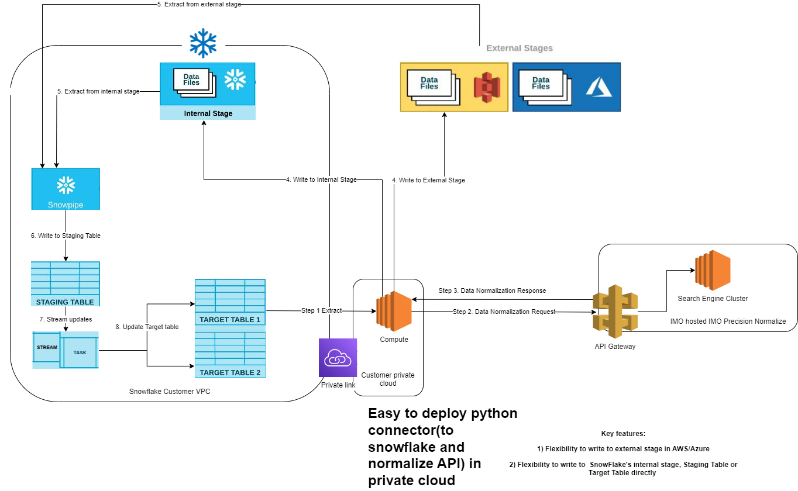

## SNOWFLAKE NORMALIZE CONNECTOR

This is a sample app that demostrates how you can normalize patient problem conditions to industry standard icd10cm codes. 

# Requirements
Install dependent packages with the following command
pip install -r requirements.txt

This will install the following python packages to your compute cluster

snowflake-connector-python
snowflake-connector-python[pandas]
snowflake-sqlalchemy

# Highlevel flow of this connector

- Step 1. Extraction of data from Snowflake Datawarehouse
  - Add M2M credentials in the config.json for Normalize API (ClientID and SecretKey)
  - Add Snowflake connection string details (USER, PWD, ACCOUNT, DATABASE AND SCHEMA)
- Step 2  Send request to Normalize API
  - This demo makes one request for one term. Ideally should bundle the request (upto 300 in one request)
- Step 3  Get response from Normalize API
  Two options for Step 4
- Step 4a Write to internal SnowFlake Stage
  - Need to configure SnowFlake internal Stage at the table level
  - TBD- steps to configure internal stage
- Step 4b. Write to external stage in AWS or Azure
- Step 5. Use Snowpipe to extract from internal or external stage and write to Snowflake staging table
- Step 6. Create a function or task to extract from staging table and write to Target table

This connector demonstrates how to write to internal Stage or write directly to Snowflake Target table

