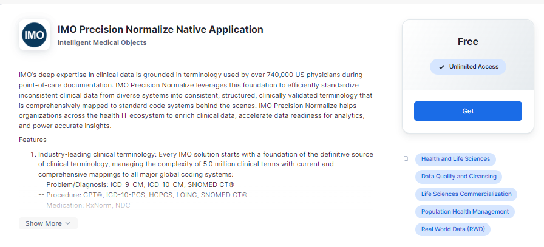
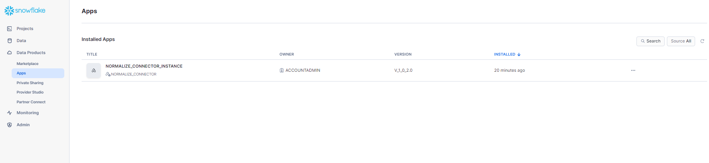
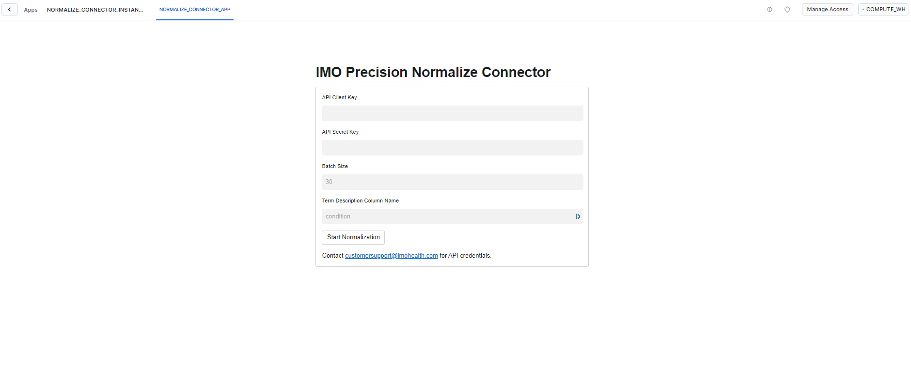

## Overview
IMO Precision Normalize can integrate with your Snowflake database in one of 2 ways:

1. Snowflake Normalize Connector (External process)
2. Snowflake Native Application (Runs inside Snowflake)

## SNOWFLAKE NORMALIZE CONNECTOR

This sample app demonstrates how you can normalize patient problem conditions to industry standard ICD10-CM codes. 

# Requirements
Install dependent packages with the following command:

```
pip install -r requirements.txt
```

This will install the following python packages to your compute cluster:

    snowflake-connector-python
    snowflake-connector-python[pandas]
    snowflake-sqlalchemy


# High-level flow of this connector


# Create Snowflake Resources
  1. Create TESTSNOWFLAKE database with default settings.
  2. Create TEST_SCHEMA schema with default settings.
  3. Create PATIENT_TERMS table with default settings.
  ```SQL 
  create table PATIENT_TERMS (
    patient_id varchar(255),
    visit_date varchar(255),
    condition varchar(255)
  )
  ```
  4. Upload patient_conditons.csv to the new table.

  

# Using the Connector
  1. Complete the extraction of data from Snowflake Datawarehouse.
      - Add M2M credentials in the config.json for Normalize API (ClientID and SecretKey).
      - Add Snowflake connection string details (USER, PWD, ACCOUNT, DATABASE AND SCHEMA).
      - Specify the write method for the script.
          * Use direct to write normalization data directly to the Snowflake table.
          * Use internal to write to an internal stage on the Snowflake table.
      - Specify batch size (API max is 20 in a single request).
  2. Send request to Normalize API.
  3. Get response from Normalize API.
  4. Two options for this step:
      - Write to internal SnowFlake Stage.
        * Run snowflake-internal-download.py to download internal stage file to local filesystem
      - Or write to external stage in AWS or Azure.
  5. Use Snowpipe to extract from internal or external stage and write to Snowflake staging table.
  6. Create a function or task to extract from staging table and write to Target table.

This connector demonstrates how to write to internal Stage or write directly to Snowflake Target table.

## Native Application

To install IMO Precision Normalize's Native Application, login to the Snowflake console and download the App from the Marketplace listing. 



Once the app is installed it will show up under Data Products->Apps



Click the installed Application to launch the App inside Snowflake. The application will load and present the following streamlit UI



Follow the pre-requisites and usage guidelines below

# Pre-requisites:
1. Contact customersupport@imohealth.com for API credentials.

1. Set up a database table named 'patient_terms' with patient conditions having the following columns (RECORD_ID, CONDITION, NORMALIZED_ICD10CM, REQUEST_ID)
1. Populate the table created in step 2. with the your dataset leaving Normalized_ICD10CM and Request_ID columns empty

# Usage:
1. Go to DataProducts -> Apps.
1. Click on Normalize_Connector_Instance (This takes less than a minute to load the streamlit application).
1. The app will prompt you to give itself access to your sample dataset, the 'patient_terms' table created in pre-requisite step 2
1. Populate IMO Precision Normalize production key and secret in the form presented.
1. Set Batch Size to 30 (We support upto a maximum of 300 terms in a single request).
1. Set the Term Description Column Name to 'condition'.
1. Click 'Start Normalization'.
This will kick of the process of your dataset normalization. 30 records are being sent to the Normalize API at a time getting the icd10cm code. You can now query your 'patient_terms' table to see the results