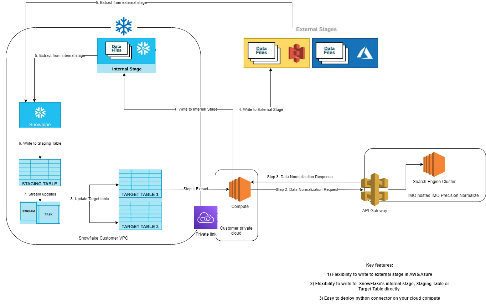
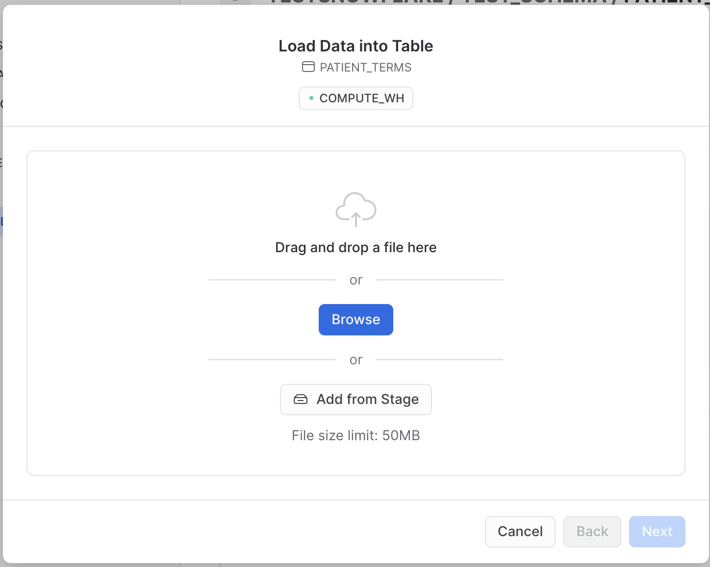

## SNOWFLAKE NORMALIZE CONNECTOR

This sample app demonstrates how you can normalize patient problem conditions to industry standard icd10cm codes. 

# Requirements
Install dependent packages with the following command:

```
pip install -r requirements.txt
```

This will install the following python packages to your compute cluster:

    snowflake-connector-python
    snowflake-connector-python[pandas]
    snowflake-sqlalchemy


# High-level flow of this connector


# Create Snowflake Resources
  1. Create TESTSNOWFLAKE database with default settings.
  2. Create TEST_SCHEMA schema with default settings.
  3. Create PATIENT_TERMS table with default settings.
  ```SQL 
  create table PATIENT_TERMS (
    patient_id varchar(255),
    visit_date varchar(255),
    condition varchar(255)
  )
  ```
  4. Upload patient_conditons.csv to the new table.

  

# Using the Connector
  1. Complete the extraction of data from Snowflake Datawarehouse.
      - Add M2M credentials in the config.json for Normalize API (ClientID and SecretKey).
      - Add Snowflake connection string details (USER, PWD, ACCOUNT, DATABASE AND SCHEMA).
      - Specify the write method for the script.
          * Use direct to write normalization data directly to the Snowflake table.
          * Use internal to write to an internal stage on the Snowflake table.
      - Specify batch size (API max is 20 in a single request).
  2. Send request to Normalize API.
  3. Get response from Normalize API.
  4. Two options for this step:
      - Write to internal SnowFlake Stage.
      - Or write to external stage in AWS or Azure.
  5. Use Snowpipe to extract from internal or external stage and write to Snowflake staging table.
  6. Create a function or task to extract from staging table and write to Target table.

This connector demonstrates how to write to internal Stage or write directly to Snowflake Target table.


